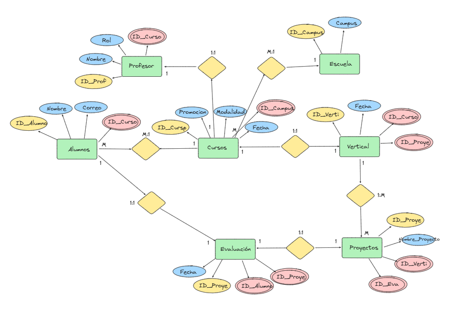

# 📚 Proyecto: Creación de Base de Datos Relacional

Este repositorio contiene el desarrollo de una base de datos relacional basada en un conjunto de datos no normalizados sobre alumnos y profesores de una escuela de bootcamps.

El objetivo del proyecto es aplicar conceptos de modelado, normalización y creación de bases de datos relacionales utilizando PostgreSQL, garantizando escalabilidad y calidad en el diseño.

---

## 🧠 Objetivos del Proyecto

- Transformar datos no normalizados en una estructura relacional eficiente.
- Aplicar normalización para reducir redundancia.
- Diseñar un modelo Entidad-Relación (E/R) y su equivalente lógico.
- Implementar la base de datos en PostgreSQL e insertar datos.
- Permitir consultas eficientes y escalables.

---

## 🧩 Estructura de la Base de Datos

### 🟢 Modelo Entidad-Relación (E/R)

### 🧱 Modelo Lógico

**Entidades y relaciones principales:**

- `Escuela`: Lista de campus.
- `Curso`: Contiene promoción, fecha y campus.
- `Vertical`: Tipo de formación (DS, FS...).
- `Profesor`: Incluye rol, curso, vertical y modalidad.
- `Alumnos`: Con nombre, correo y curso asociado.
- `Proyecto`: Evaluaciones por vertical.
- `Evaluacion`: Nota de un alumno en un proyecto.

Todas las entidades están correctamente normalizadas e interrelacionadas mediante claves foráneas.

---

## 🧪 Archivos Incluidos

- `diagrams/`: diagramas del modelo lógico y E/R.
- `sql/create_tables.sql`: script de creación de tablas.
- `sql/insert_data.sql`: inserción de datos base.
- `README.md`: documentación del proyecto.

---

## 📈 Escalabilidad

El modelo está preparado para escalar en:

- Nuevos campus (Madrid, Valencia, etc.)
- Nuevas verticales (Data Science, Full Stack, etc.)
- Modalidades (Online, Presencial)
- Nuevas promociones y aulas

---

## 🚀 Hosting de la Base de Datos

Se recomienda utilizar servicios gratuitos como [Render](https://render.com/docs/databases) para alojar la base de datos y permitir conexiones externas para futuras integraciones.

---

## 📅 Entrega y Presentación

📆 **Fecha de entrega**: Viernes 11 de abril a las 12:00  
🗣️ **Formato**: Presentación técnica por grupo mostrando:
- Estructura creada
- Datos ingestados
- Consultas de ejemplo sobre la base de datos

---

## 👨‍💻 Autores

Trabajo realizado por:

- Renan Muniz  
- Jorge Alonso  
- Miguel Ángel [...]  
- Vicen [...]
